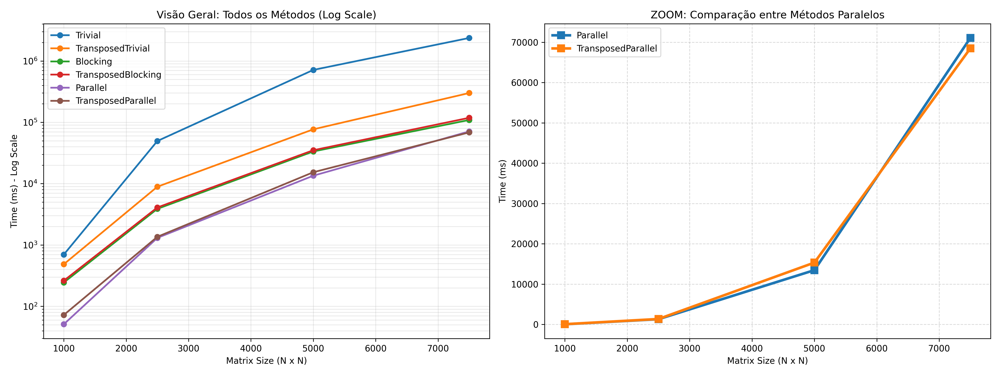

# Multi-threaded Matrix Multiplication Benchmarking

Este projeto explora diferentes técnicas de otimização de performance em CPU para a multiplicação de matrizes quadradas ($C = A \times B$), um dos pilares da computação de alto desempenho (HPC). O objetivo é demonstrar como o **layout de memória**, a **hierarquia de cache** e o **paralelismo multi-core** impactam drasticamente o tempo de execução.

## 🚀 Resultados (N=7500)

O benchmark abaixo reflete os tempos obtidos em uma matriz de $7500 \times 7500$ (ponto flutuante de precisão dupla), comparando a implementação ingênua com métodos otimizados.

| Método | Tempo (ms) | Speedup | Observação |
| :--- | :---: | :---: | :--- |
| **Trivial** | 2.368.997 | 1.0x | Algoritmo base $O(n^3)$ com Cache Misses constantes. |
| **Transposed Trivial** | 300.015 | 7.9x | Melhora a localidade espacial ao ler B sequencialmente. |
| **Blocking (Tiling)** | 109.107 | 21.7x | Maximiza a localidade temporal mantendo blocos no Cache L1/L2. |
| **Parallel** | 71.064 | 33.3x | Divisão de carga entre múltiplos núcleos via `std::thread`. |
| **Transposed Parallel** | **68.489** | **34.5x** | O estado da arte: Cache-friendly + Multi-core. |

## 🛠️ Implementações

### 1. Trivial (Baseline)
A implementação clássica com três loops aninhados ($i, j, k$). O principal gargalo aqui é o acesso por colunas na Matriz B. Como matrizes são armazenadas em *Row-Major* (linha após linha), saltar entre colunas quebra o fluxo do cache, forçando a CPU a buscar dados diretamente na RAM.

### 2. Transposição (Spatial Locality)
Ao transpor a Matriz B para uma matriz auxiliar $T$ ($T[j][k] = B[k][j]$), transformamos acessos por coluna em acessos por linha. Isso permite que o **Hardware Prefetcher** da CPU antecipe os dados e carregue linhas inteiras para o cache L1 antes de serem necessárias.

### 3. Blocking / Tiling (Temporal Locality)
Divide as matrizes em pequenos blocos (Tiles) que cabem inteiros nos caches de níveis superiores (L1/L2). Esta técnica garante que um dado carregado seja reutilizado o máximo de vezes possível antes de ser descartado da hierarquia de memória.

### 4. Multithreading
Utiliza `std::thread::hardware_concurrency()` para distribuir o processamento das linhas de forma independente entre os núcleos da CPU. A implementação evita o *False Sharing* e o custo excessivo de criação de threads ao instanciá-las apenas uma vez no início do cálculo.

## 📈 Análise de Performance
Os testes demonstram o fenômeno do **Memory Wall**. Em matrizes de grande escala ($N=7500$), a computação bruta deixa de ser o gargalo, e a eficiência passa a depender quase exclusivamente da largura de banda da memória e do gerenciamento inteligente do cache. A combinação de **Transposição + Paralelismo** reduziu o tempo de execução de quase **40 minutos** para apenas **68 segundos**.



## 💻 Como Executar

### Pré-requisitos
* Compilador G++ (suporte a C++20).
* Python 3 e bibliotecas `pandas` e `matplotlib` (para os gráficos).

### Compilação (Linux/GCC/MinGW)
```bash
g++ -O3 -Iinclude src/big_matrix.cpp src/main.cpp -o matrix_bench -lpthread
```
*Nota: A flag `-O3` é fundamental para permitir que o compilador realize a vetorização (SIMD) automática das operações.*
### Gerando Gráficos
python: benchmarks/plot_results.py
